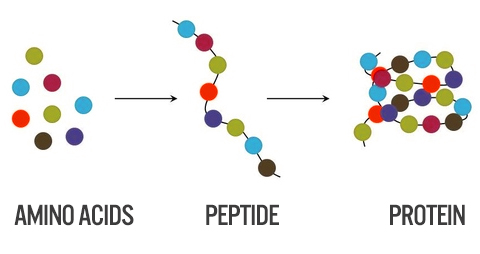
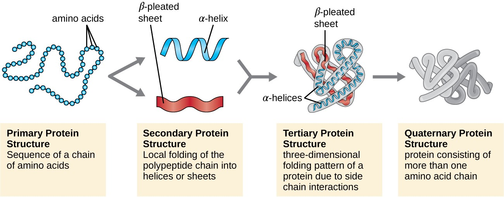
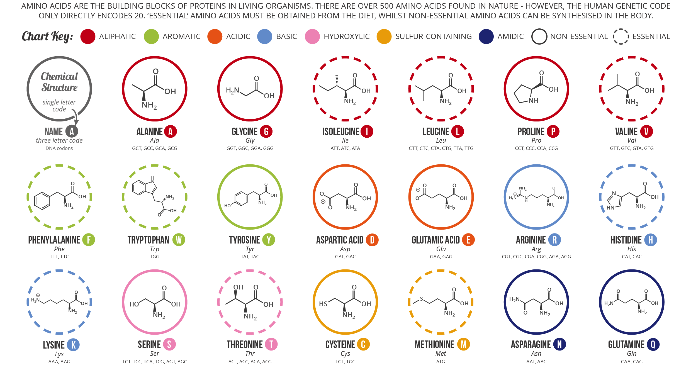
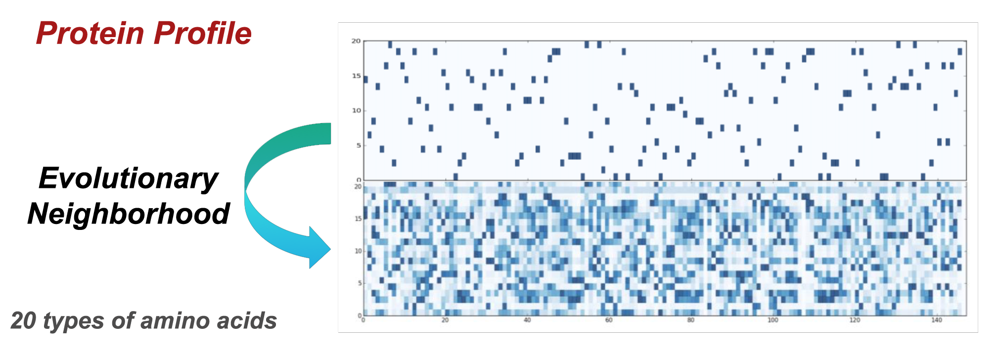
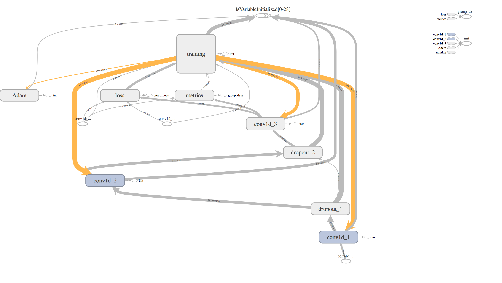
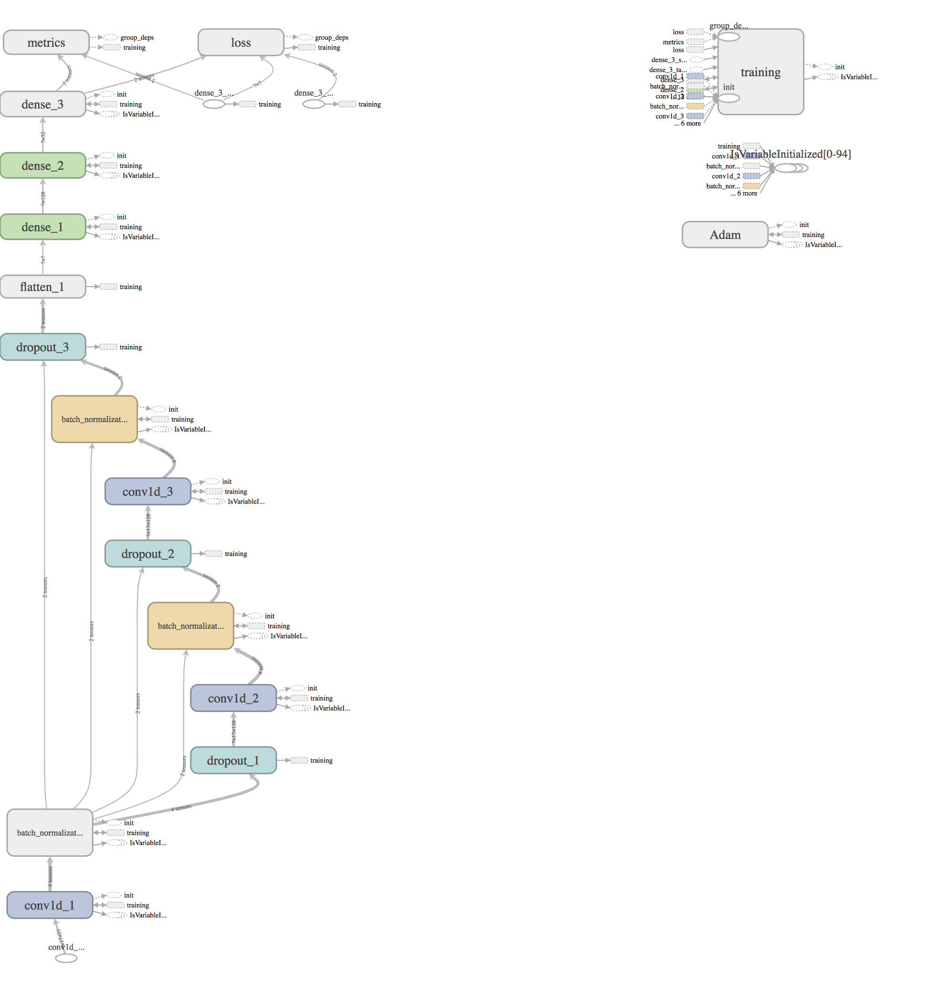
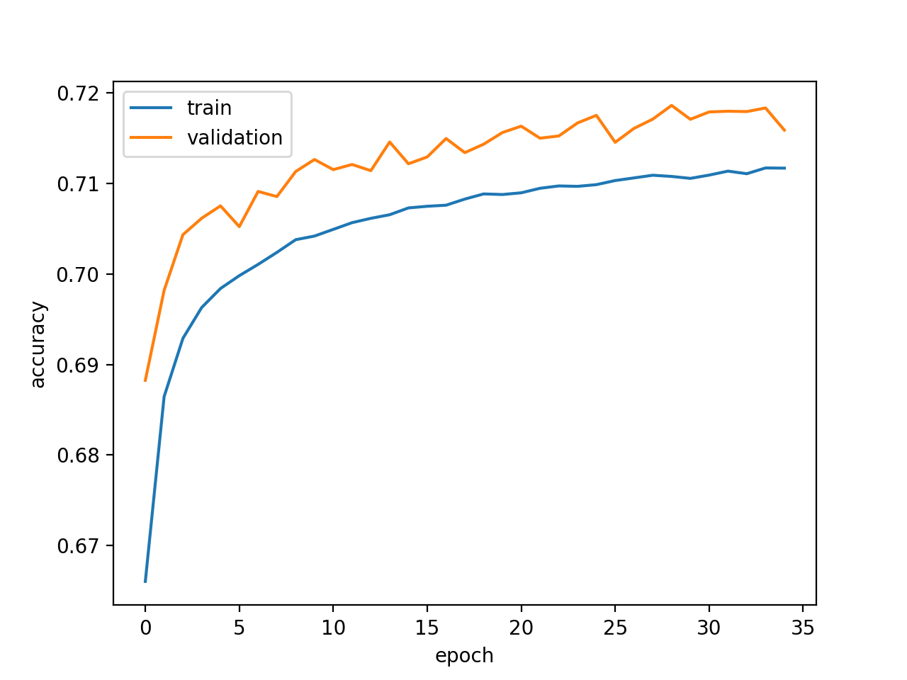
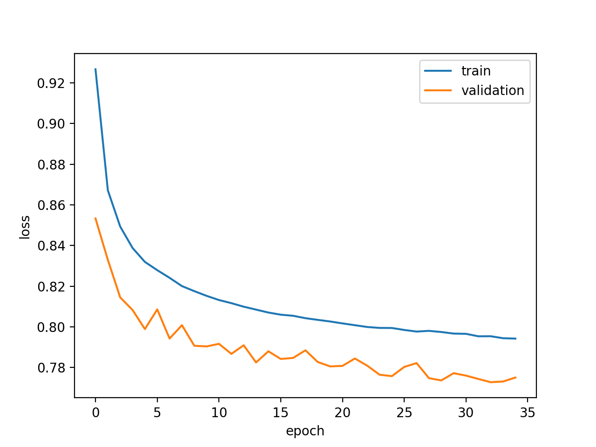
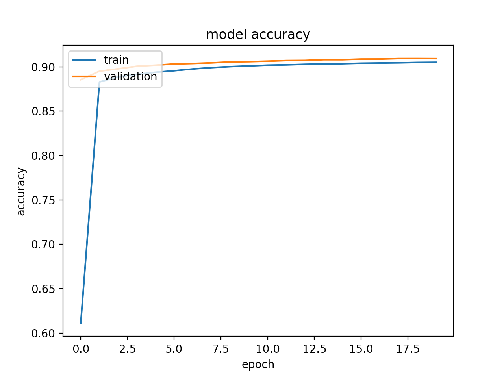
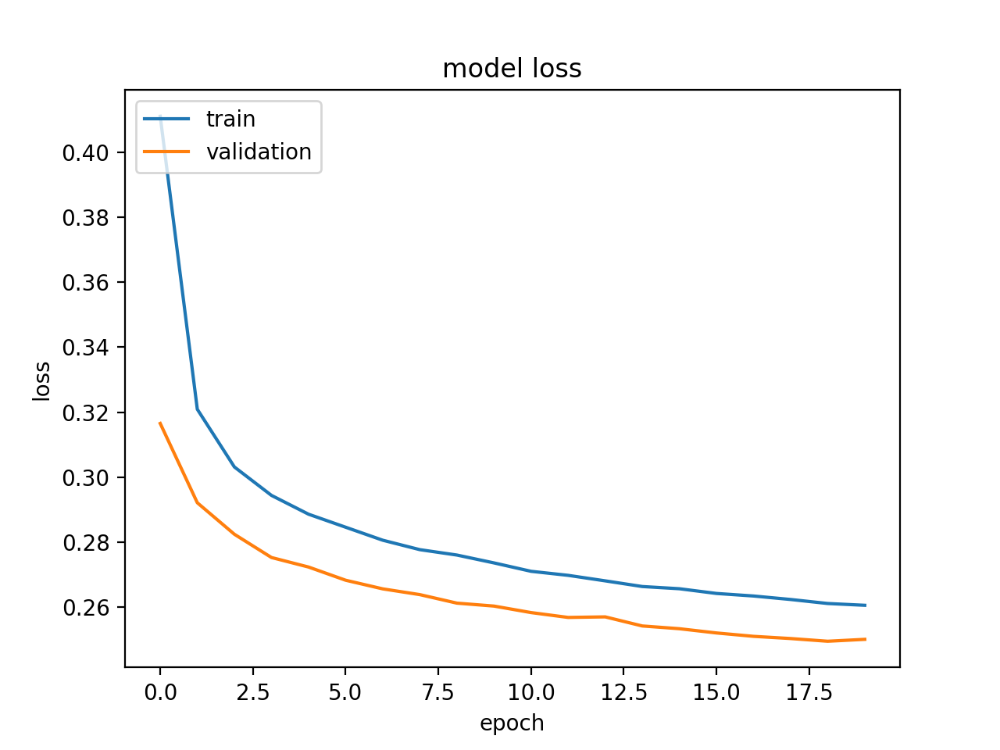

# Protein Secondary Structure Predictor
Protein secondary structor predictor using CNN

___

## Introduction
Proteins are chains of amino acids joined together by peptide bonds. Many conformations of this chains are possible due to the many possible combinations of amino acids and rotation of the chain in multiple positions along the chain. It is these conformational changes that are responsible for differences in the three dimensional structure of proteins.



Protein structure prediction is one of the most important goals pursued by bioinformatics and theoretical chemistry; it is highly important in medicine (for example, in drug design) and biotechnology (for example, in the design of novel enzymes). [[1]](#references)

When we talk about the structure of proteins, four different structure levels are mentioned: the primary, secondary, tertiary and quaternary structure.



Protein primary structure is the linear sequence of amino acids in a peptide or protein.

Protein secondary structure is the three dimensional form of local segments of proteins. Secondary structure elements typically spontaneously form as an intermediate before the protein folds into its three dimensional tertiary structure.
Both protein and nucleic acid secondary structures can be used to aid in [multiple sequence alignment](https://en.wikipedia.org/wiki/Multiple_sequence_alignment).

The tertiary structure is however particularly interesting as it describes the 3D structure of the protein molecule, which reveals very important functional and chemical properties, such as which chemical bindings the protein can take part in.

Predicting protein tertiary structure from only its amino acid sequence is a very challenging problem, but using the simpler secondary structure definitions is becomes more tractable. [[2]](#references)

I focused on the primary and secondary structure (SS), more specifically on using Convolutional Neural Networks (CNNs) for predicting the secondary structure of proteins given their primary structure.

## Protein Structures and Protein Data
The primary structure of proteins are described by the sequence of amino acids on their polypeptide chain.



There are 20 natural occuring amino acids which, in a one letter notation, is denoted by: ’A’, ’C’, ’D’, ’E’, ’F’, ’G’, ’H’, ’I’, ’K’, ’L’, ’M’, ’N’, ’P’, ’Q’, ’R’, ’S’, ’T’, ’V’, ’W’, ’Y’. ’A’ standing for Alanine, ’C’ for Cysteine, ’D’ for Aspartic Acid etc. A 21st letter, ’X’, is sometimes used for denoting an unknown or any amino acid.

Instead of using the  primary structure as a simple indicator for the presence of one of the amino acids, a more powerful primary structure representation has been used: **Protein Profiles**.
These are used to take into account evolutionary neighborhoods and are used to model protein families and domains. They are built by converting multiple sequence alignments into position-specific scoring systems (PSSMs). Amino acids at each position in the alignment are scored according to the frequency with which they occur at that position. [[3]](#references)



A protein’s polypeptide chain typically consist of around 200-300 amino acids, but it can consist of far less or far more. The amino acids can occure at any position in a chain, meaning that even for a chain consisting of 4 amino acids, there are 204 possible distinct combinations. In the used [dataset](#the-dataset) the average protein chain cosists of 208 amino acids.

Proteins’ secondary structure determines structural states of local segments of amino acid residues in the protein. The alpha-helix state for instance forms a coiled up shape and the beta-strand forms a zig-zag like shape etc. The secondary structure of the protein is interesting because it, as mentioned in the introduction, reveals important chemical properties of the protein and because it can be used for further predicting it’s tertiary structure. When predicting protein's secondary structure we distinguish between **3-state SS** prediction and **8-state SS** prediction.

For 3-state prediction the goal is to classify each amino acid into either:
- alpha-helix, which is a regular state denoted by an ’H’.
- beta-strand, which is a regular state denoted by an ’E’.
- coil region, which is an irregular state denoted by a ’C’.
The letters which denotes the above secondary structures are not to be confused with those which denotes the amino acids.

For 8-state prediction, Alpha-helix is further sub-divided into three states: alpha-helix (’H’), 310 helix (’G’) and pi-helix (’I’). Beta-strand is sub-divided into: beta-strand (’E’) and beta-bride (’B’) and coil region is sub-divided into: high curvature loop (’S’), beta-turn (’T’) and irregular (’L’). [[2]](#references)

    E = extended strand, participates in β ladder
    B = residue in isolated β-bridge
    H = α-helix
    G = 3-helix (3-10 helix)
    I = 5-helix (π-helix)
    T = hydrogen bonded turn
    S = bend
    _ = loop (any other type)

For the scope of this project the more challenging 8-state prediction problem has been chosen.

## Dataset
The dataset used is CullPDB data set, consisting of 6133 proteins each of 39900 features.
The 6133 proteins × 39900 features can be reshaped into 6133 proteins × 700 amino acids × 57 features.

The amino acid chains are described by a 700 × 57 matrix to keep the data size consistent. The 700 denotes the peptide chain and the 57 denotes the number of features in each amino acid. When the end of a chain is reached the rest of the vector will simply be labeled as ’No Seq’ (a padding is applied).

Among the 57 features, 22 represent the primary structure (20 amino acids, 1 unknown or any amino acid, 1 'No Seq' -padding-), 22 the Protein Profiles (same as primary structure) and 9 are the secondary structure (8 possible states, 1 'No Seq' -padding-).

The Protein profiles where used instead of the amino acids residues.

For a more detailed description of the dataset and for download see [[4]](#references).

In a first phase of research the whole amino acid sequence was used as an examle (700 x 22) to predict the whole secondary structure (label) (700 x 9).

In the second phase, local windows of a limited number of elements, shifted along the sequence, were used as examples (`cnn_width` x 21) to predict the secondary structure (8 classes) in a single location in the center of each window (The 'No Seq' and padding were removed and ignored in this phase because it wasn't necessary anymore for the sequences to be of the same length).

The Dataset (of 6133 proteins) was devided randomly into training (5600), validation (256) and testing (272) sets, as suggested by [[5]](#references) for the results shown below.

However different splits of the dataset with different sizes have been tested with equal results.

## Implementation
This project was implemented using the **Keras** framework with the **Tensorflow** backend.

Two main approaches have been explored:
1. Use the whole protein sequence (primary structure) as an example for the CNN, with an output of dimension 700 x 9, the sequence of the predicted secondary structure.
2. Use local windows of a limited number of elements as an example for the CNN which is shifted along the sequences, predicting for each window the secondary structure in a single location (8 classes), in the center of each window.

### 1) Whole protein prediction
This simple model consists of 3 main 1D Convolutional Layers:

```Python
LR = 0.0005
drop_out = 0.3
batch_dim = 64

loss = 'categorical_crossentropy'

# We fix the window size to 11 because the average length of an alpha helix is around eleven residues
# and that of a beta strand is around six.
# See references [6].
m = Sequential()
m.add(Conv1D(128, 11, padding='same', activation='relu', input_shape=(dataset.sequence_len, dataset.amino_acid_residues)))
m.add(Dropout(drop_out))
m.add(Conv1D(64, 11, padding='same', activation='relu'))
m.add(Dropout(drop_out))
m.add(Conv1D(dataset.num_classes, 11, padding='same', activation='softmax'))
opt = optimizers.Adam(lr=LR)
m.compile(optimizer=opt,
          loss=loss,
          metrics=['accuracy', 'mae'])
```
The resulting computation graph (from tensorboard):



This was a first prototype, with a low number of parameters (125.512 trainable paramenters). A major problem with this approach, was the fact that the padding added to shorter sequences, still influenced the loss, calculated on the whole output sequence ('categorical_crossentropy' loss from tensorwlow was used).

This required the creation of a custom loss to take into account the outputs from the padding region, which is of different shape for each example.

Soon this approach was abandoned.

### 2) Window CNN
This model implementation:
```Python
cnn_width = 17

LR = 0.0009 # maybe after some (10-15) epochs reduce it to 0.0008-0.0007
drop_out = 0.38
batch_dim = 64

loss = 'categorical_crossentropy'

m = Sequential()
m.add(Conv1D(128, 5, padding='same', activation='relu', input_shape=(cnn_width, dataset.amino_acid_residues)))
m.add(BatchNormalization())
m.add(Dropout(drop_out))
m.add(Conv1D(128, 3, padding='same', activation='relu'))
m.add(BatchNormalization())
m.add(Dropout(drop_out))
m.add(Conv1D(64, 3, padding='same', activation='relu'))
m.add(BatchNormalization())
m.add(Dropout(drop_out))
m.add(Flatten())
m.add(Dense(128, activation='relu'))
m.add(Dense(32, activation='relu'))
m.add(Dense(dataset.num_classes, activation = 'softmax'))
opt = optimizers.Adam(lr=LR)
m.compile(optimizer=opt,
          loss=loss,
          metrics=['accuracy', 'mae'])
```

The resulting computation graph (from tensorboard):



The size of the window has been chosen to be bigger than 11 because the average length of an alpha helix is around eleven residues and that of a beta strand is around six (See references [6]). Multiple even sizes from 11 to 23 were tested, with 17 yielding the best results (performance/training time trade off).

This model has 232.552 parameters (Trainable params: 231.912) and was trained on 946494 samples, validated on 120704 samples (windows).

## Results
The Window CNN has been trained with the CullPDB dataset split like described in [Dataset section](#Dataset) for 35 epochs (on CPU in approximately 6 hours).

The learning curves are shown below:

[]() | []() 
|:---:|:---:|
| Window CNN Accuracy (Q8 Accuracy)| Window CNN Loss |

The accuracy on the test set achieved with this model is equal to `0.721522` (Q8 Accuracy), which is comparable to the results obtained in [[5]](#references) and [[6]](#references) using different techniques.

The model has also been trained with the filtered version of the dataset: `CullPDB6133+filtered` available at [[4]](#references) and tested with the public benchmark **CB513**. The accuracy obtained is equal to `0.6833` (Q8 Accuracy), again comparable with [[5]](#references) and [[6]](#references).

#### Whole protein prediction
This model has been trained with the CullPDB dataset split like described in [Dataset section](#Dataset) for just 20 epochs (on CPU in approximately 25 minutes).

The learning curves are shown below (in this model the loss is calculated without taking the padding into account, so the resulting values are biased):

[]() | []() 
|:---:|:---:|
| Whole protein CNN Accuracy (Q8 Accuracy)| Whole protein CNN Loss |

The accuracy on the test set achieved with this model is equal to `0.6966` (Q8 Accuracy), whis is pretty close to the results obtained with the Window CNN in a small fraction of the time required for the Window CNN.

Moreover the accuracy obtained training on the filtered dataset and testing on the CB513 dataset, is equal to `0.6557` (Q8 Accuracy).

## References
\[1\]: https://en.wikipedia.org/wiki/Protein_structure_prediction

\[2\]: https://en.wikipedia.org/wiki/Protein_secondary_structure

\[3\]: https://www.ebi.ac.uk/training/online/course/introduction-protein-classification-ebi/what-are-protein-signatures/signature-types/what-are-

\[4\]: http://www.princeton.edu/%7Ejzthree/datasets/ICML2014/

\[5\] Jian Zhou and Olga G. Troyanskaya (2014) - "Deep Supervised and Convolutional Generative Stochastic Network for Protein Secondary Structure Prediction" - https://arxiv.org/pdf/1403.1347.pdf

\[6\] Sheng Wang et al. (2016) - "Protein Secondary Structure Prediction Using Deep Convolutional Neural Fields" - https://arxiv.org/pdf/1512.00843.pdf
